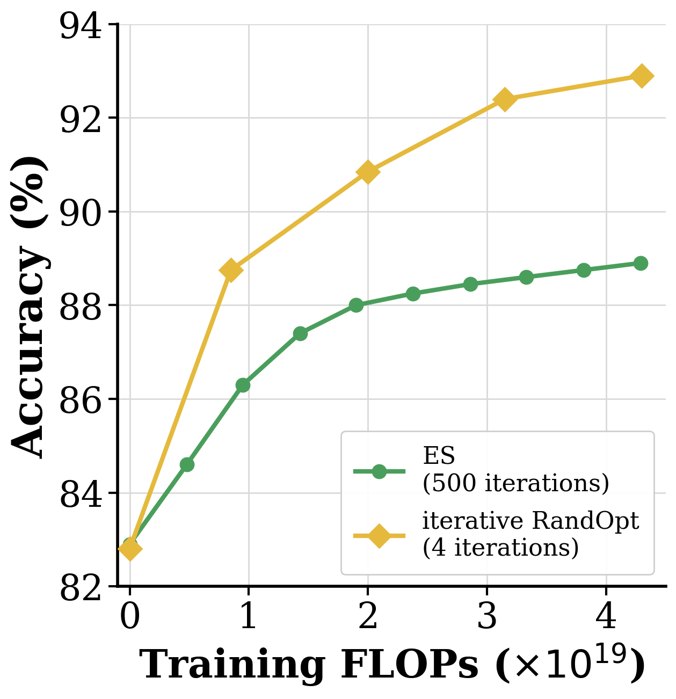

# iterative-randopt

<p align="center">
  
</p>

**Iterative RandOpt** runs RandOpt in a loop: each round goes **random guessing → ensemble → distill**
back into a single model, and the next round starts from that distilled model. Accuracy is always
measured on the **single distilled model** — no ensemble at inference.

### Pick your path

- **Just want to run it**, nothing else installed → [1. Standalone](#1-standalone)
- **Already using verl** → [2. verl users](#2-verl-users)
- **Already using TRL** → [3. TRL users](#3-trl-users)

Installing is additive and non-invasive: the package imports as `iterative_randopt`, not
shadows the `verl`, and installed with `--no-deps` it won't touch your pinned
`torch` / `vllm` / `transformers` / `peft`.

---

## 1. Standalone

You just want to use this repo on its own.

```bash
git clone https://github.com/sunrainyg/RandOpt.git
cd RandOpt
pip install -e .          # pulls torch / vllm / transformers / ray / peft ...
```

Run it:

```bash
iter_randopt --config configs/iterative_randopt_gsm8k.yaml
# or fully from flags:
iter_randopt --model Qwen/Qwen2.5-1.5B-Instruct --dataset gsm8k --rounds 4 --num_gpus 8
```

Or from Python:

```python
from iterative_randopt import IterativeRandOptConfig, run
run(IterativeRandOptConfig(model="Qwen/Qwen2.5-1.5B-Instruct", rounds=4))
```

---

## 2. verl users

You already have a working verl env: add iterative RandOpt without changing any of it. The recipe
reuses **your own** verl trainer; nothing in your verl install is modified.

```bash
git clone https://github.com/sunrainyg/RandOpt.git && cd RandOpt
pip install -e . --no-deps        # --no-deps keeps your verl / torch / vllm versions untouched

python -m iterative_randopt.stages.prepare_gsm8k --local_save_dir data/gsm8k
python -m iterative_randopt.verl_recipe.main --config verl_recipe/config/iterative_randopt_gsm8k.yaml
```

It drives verl's own `verl.trainer.fsdp_sft_trainer` (SFT step) and `verl.model_merger` (export the
HF checkpoint each round), and only adds the outer on-policy loop (rollout → reject → SFT). Point the
config's model/data/trainer fields at whatever you already use.

> Because it invokes those verl CLIs directly, it needs a verl build that still exposes them
> (verified on `0.7.0.dev`; PyPI `0.8.0` relocated `verl.trainer.fsdp_sft_trainer`). If a module path
> or Hydra key moved in your verl, you'll get a clear `ModuleNotFoundError`/argument error — adjust
> `verl_recipe/main.py` (usually a one-line fix).

---

## 3. TRL users

You already have TRL: swap in one trainer class. `IterativeRandOptTrainer` mirrors `GRPOTrainer`:
same reward-function signature (`(prompts, completions, **kwargs) -> list[float]`) and a `SFTConfig`
subclass, so your existing reward funcs and configs carry over unchanged.

```bash
git clone https://github.com/sunrainyg/RandOpt.git && cd RandOpt
pip install -e . --no-deps        # keeps your trl env as-is
# no trl yet? pip install -e ".[trl]"
```

```python
from transformers import AutoTokenizer
from iterative_randopt.trl import IterativeRandOptTrainer, IterativeRandOptTRLConfig
from iterative_randopt.reward import gsm8k_reward

tok = AutoTokenizer.from_pretrained("Qwen/Qwen2.5-1.5B-Instruct")
# ds: rows with {'prompt': [ {role, content} ... ], 'ground_truth': "..."}

trainer = IterativeRandOptTrainer(
    model="Qwen/Qwen2.5-1.5B-Instruct",
    args=IterativeRandOptTRLConfig(
        output_dir="out", num_rounds=4, num_generations=16, gen_temperature=1.0,
        n_canonical=8, keep_incorrect_frac=0.0, sft_from_base=True, cumulative=True,
        per_device_train_batch_size=2, gradient_accumulation_steps=64,
        num_train_epochs=2, learning_rate=1e-4, lora_rank=192,
    ),
    train_dataset=ds,
    reward_funcs=gsm8k_reward,     # your existing GRPO reward funcs work unchanged
    processing_class=tok,
)
trainer.train()
```

> Run on a **single visible GPU** (`CUDA_VISIBLE_DEVICES=0 python train.py`): this trainer co-locates
> vLLM + SFTTrainer in one process, so exposing multiple GPUs makes HF Trainer DataParallel collide
> with vLLM's CUDA context. For fully-sharded 8-GPU reproduction, use the standalone path above.

---

## Tested versions

The adapters shell into verl/TRL's **internal** interfaces, so they are version-sensitive: installing
never breaks your env, but running an adapter needs a version that still exposes what it calls. Verified on:

| component | verified version |
|-----------|------------------|
| vllm | `0.11.0` |
| transformers | `4.57.1` |
| standalone / TRL | `trl >= 0.12.0` |
| verl | `0.7.0.dev` |

If a framework upgrade moves or renames those interfaces, the adapter errors out clearly (e.g. an
`ImportError`/`ModuleNotFoundError` on the verl module path, or a `TypeError` on an `SFTConfig`/
`SFTTrainer` argument). Fixes are usually small, e.g., a module path, a Hydra key, or a config field. If you
only need the method and not your exact framework build, the **standalone path has no such coupling**.

## Results

**OLMo-3-Instruct-7B** on **GSM8K**, single model for inference (no ensemble):

<p align="center">
  
</p>

Reproduce this run on a single 8-GPU node:

```bash
iter_randopt --config configs/iterative_randopt_gsm8k_olmo3_7b.yaml
```
Performance:
`86.66% → 90.30% → 91.58% → 92.57% → `**`92.87%`**.
